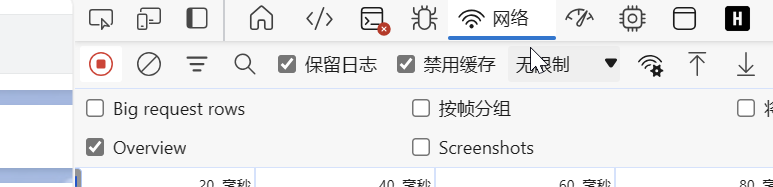
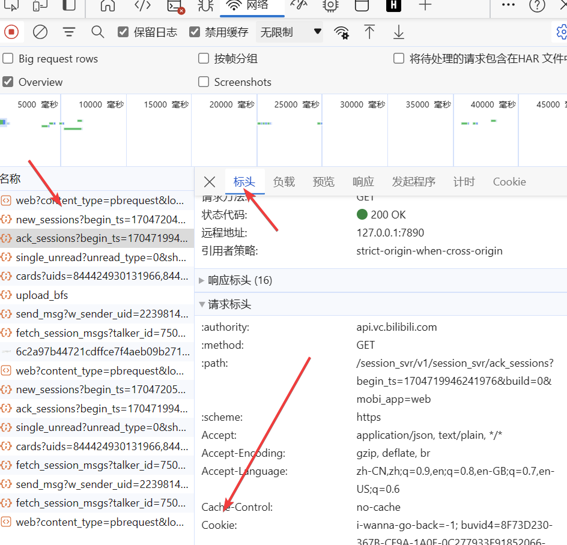
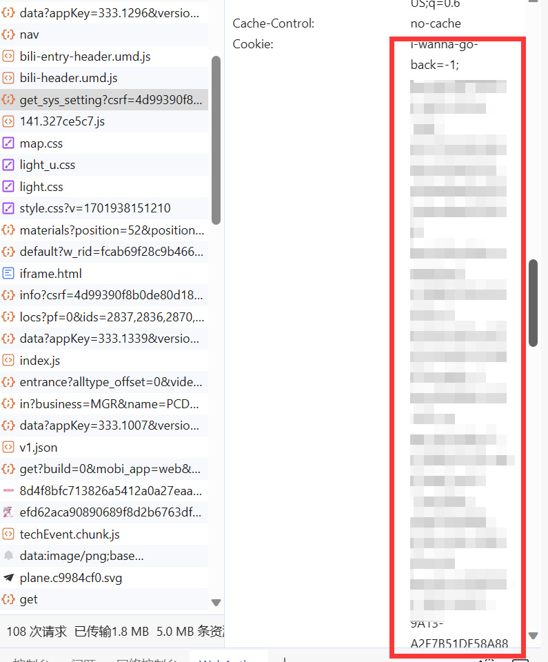

# 通过游览器开发者工具（F12）查看自己的Cookie
因为太多人来问cookie怎么取，所以这里以edge为例，写一个完整的操作步骤

## 操作
 1.先调出游览器的开发者工具，一般是F12或者是Ctrl+Shift+I，如果都不行可以在**更多工具-开发人员工具**里找到 
 2.切换到**网络**(Network) 
  
  
 3.刷新页面，随便找一个b站的请求包，看**标头(Head)栏里的请求标头-Cookie** 
  
  
 4.直接复制后面这一大串即可，注意把回车什么的去了就行了 
 
### 其他
* 因为cookie是用于向服务器表面自己的身份，所以提醒小白如果要截图发给别人记得打码，B站使用cookie登录是不会有异地登录提示的，登录日志里也不会显示
* 如果使用document.cookie在控制台取cookie，那么就需要自行添加SESSDATA这个key，因为被设置httponly了，脚本是取不到的
* 没有记错的话，主要鉴权的key参数分别是bili_ticket,bili_ticket_expires,SESSDATA,sid,bili_jct,buvid_fp,buvid4,_uuid,buvid3，自己一个个挑出来拼接，不如直接全部复制放入
* 本人B站UID：2239814，如您依旧有疑问，可直接B站私信我
