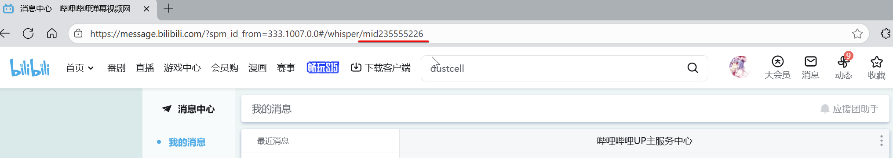

# BiliBili_Private_Msg
哔哩哔哩(B站)私信导出工具，同时支持导出已经被撤回的/无法查看的消息（不包含私信存档）

## 环境
环境：.NET Framework 4.0  或 python 3.10.5 

### 操作
 (如要导出所有联系人的私信消息，请使用python版本) 
 1.针对性导出请运行exe或使用python文件夹下的BiliBili_Private_Msg.py 
 BiliBili_Private_Msg(ALL).py是将整个私信列表中所有人的消息一块导出到由时间命名的文件夹中 
 2.通过游览器F12查看自己的Cookie，填入Cookie，如何寻找cookie，请看[通过游览器开发者工具（F12）查看自己的Cookie](./Get_cookie/README.md) 
 3.选择类型，需要导出的消息是私信还是应援团 
 4.填入对方的UID或MID，如下图，导出与哔哩哔哩UP主执事的聊天记录，则填235555226 

 5.点击导出，当提示成功或已保存文件即可在exe/py文件所在的文件夹找到对应的TXT文件（或时间文件夹） 
 6.(可选)如果要使用python版本导出应援团的消息，请将session_type的值设置为2
### 思路/博客/注意/其他
* 使用BiliBili_Private_Msg(ALL).py时，如果私信列表中的人数过多，请自行取消`time.sleep(2)`的注释，避免ip被ban
* 关于该API的详情请见 [哔哩哔哩-API收集整理](https://github.com/SocialSisterYi/bilibili-API-collect/blob/master/docs/message/private_msg.md)
* 思路等请见[博客](https://hd80606b.com/bilibili-message/) 
* 在V1.3.0中增加了屏蔽 B 站系统账号的功能([#4](https://github.com/hd80606b/BiliBili_Private_Msg/issues/4))，同时修复了部分用户消息导出时会导致死循环的问题（现在使用has_more来判断消息列表是否结尾），暂未对C#版本进行更新
* 在V1.2.0中修复了预约直播消息无法被正常导出的bug，同时对C#版本的程序进行了全面的更新
* 在V1.1.1中添加了请求头，修正了请求被禁止的问题，~~暂时让预约直播的消息变更为了default（C#版本暂未进行更改，请优先使用python脚本）~~
* 在V1.1.0中添加了新的参数从根本上修正了只返回前200条消息的问题
* ~~在即将到来的V1.1.1中也会把C#版本的程序将被重构~~，添加**一键导出私信列表中所有人的消息**的功能与修正**请求被禁止**的问题
* ~~你问我为什么要放打包文件，因为单放exe文件会报不安全~~
* ~~远古代码，为什么还是4.0？为什么当初没有做成控制台应用？~~ 所以在这里追加了python版本
* 本人B站UID：2239814，如您觉得提issue太麻烦，可直接B站私信我
### 感谢
* [@ccsugar](https://github.com/ccsugar) 为BiliBili_Private_Msg(ALL).py添加私信对象昵称提供思路和接口
* [@xiaobukeaimiao](https://github.com/xiaobukeaimiao) 的建议：屏蔽 B 站系统账号的功能
---
#### 已知问题
* 被撤回的消息现在疑似无法再读取了（记一笔，B站在24年1月似乎修复了）
* 2017年10月以前的私信存档，疑似已经从B站服务器上删除了，无法再获取
* ~~有极少数用户的消息，返回的min_seqno为1，这将导致程序进入死循环，返回的记录文件卡在重复输入最后一条私信，因此如程序运行时间过长，建议手动关闭检查聊天日志~~（已于V1.3.0修复）
* 目前默认屏蔽的 B 站系统账号为："哔哩哔哩智能机", "UP主小助手", "哔哩哔哩创作中心","装扮小姐姐","哔哩哔哩大会员",
    "直播小喇叭", "社区小助手", "哔哩哔哩公益","哔哩哔哩智能机","支付小助手","小站助手",
    "哔哩哔哩数字周边","哔哩哔哩UP主服务中心"
